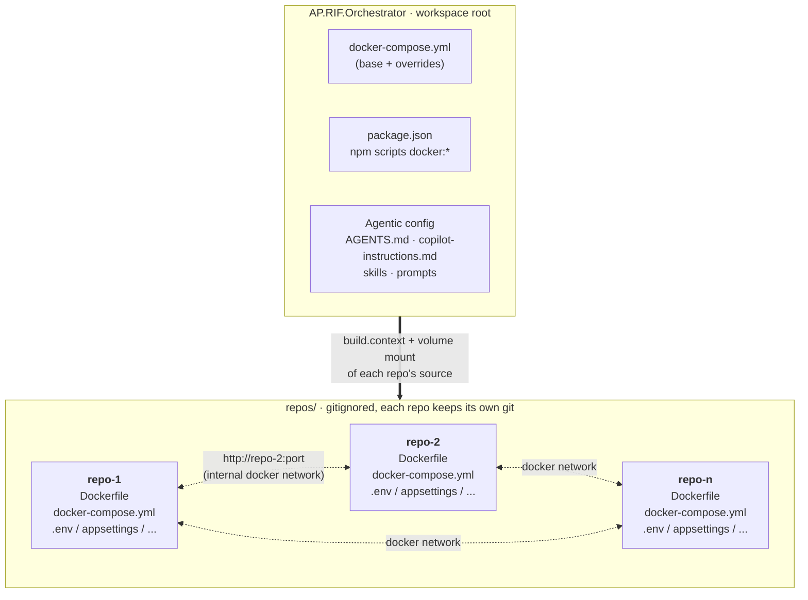

# Get Started

Onboarding guide to get the Orchestrator running with your own repos.

Designed for **already dockerized repos** (with a ready `Dockerfile`) or repos you're willing to dockerize along the way. The Orchestrator doesn't touch your repos' business logic and doesn't duplicate their config — it just wraps them so they run together with a single command.

---

## How the pieces communicate



**What's happening in the diagram:**

- **Top** — The Orchestrator centralizes two things: docker orchestration (`docker-compose.yml` + overrides + npm scripts) and the **shared agentic config** (`AGENTS.md`, `copilot-instructions.md`, skills, prompts, etc.). The latter applies to every repo below without having to replicate it in each one.
- **Bottom** — `repos/` is a gitignored folder where every repo lives with its own independent git. Each repo ships its `Dockerfile`, its standalone `docker-compose.yml`, and its runtime config files (`.env`, `appsettings.*.json`, etc.).
- **Thick arrow** — the Orchestrator's compose **reaches into each repo** via `build.context` (to build the image) and volume mount (so the container reads the repo's source and config, without duplicating anything).
- **Dotted arrows** between repos — runtime communication: when the Orchestrator brings them up together they live on the same internal docker network and address each other by service name (`http://<alias>:<port>`), NOT by `localhost`.

---

## Quick setup

1. **Clone the Orchestrator and enter it:**
   ```powershell
   git clone <orchestrator-url> AP.RIF.Orchestrator
   cd AP.RIF.Orchestrator
   ```

2. **Clone each repo you want to orchestrate into `repos/`.** That folder is gitignored, so every repo keeps its own git:
   ```powershell
   cd repos
   git clone <repo-1-url>
   git clone <repo-2-url>
   cd ..
   ```

3. **Make sure each repo is dockerized.** At minimum a `Dockerfile` (with CMD binding to `0.0.0.0`, not `localhost`) and a `.dockerignore`. If the repo doesn't ship them, see per-stack templates in [How to add new repos?](ADDING_REPOS.md#11-dockerfile-dev-image).

4. **Pick a short alias** for each repo (`web`, `worker`, `auth`, `payments`, ...) and register it in 2 places in the Orchestrator:
   - [docker-compose.yml](docker-compose.yml) → new service with `profiles: ["all", "<alias>"]`, `build.context: ./repos/<Repo>`, published port, and source volume mount.
   - [package.json](package.json) → `"docker:<alias>": "docker compose --profile <alias> up --build"`.

   >
   > The alias lives in 3 places (standalone compose, Orchestrator compose, npm script).
   >
   > Use the same string in all 3 to avoid ambiguity.
   >
   > Detail: [How to add new repos → Choosing an alias for the repo](ADDING_REPOS.md#choosing-an-alias-for-the-repo).
   >

5. **Populate each repo's runtime config** (the files the repo already uses locally: `appsettings.Development.json`, `.env`, etc.). The Orchestrator doesn't duplicate them — they're read via each repo's source volume mount.

   >
   > If your repo hardcodes URLs to `localhost` to reach another internal service, a small additive patch is needed.
   >
   > Detail in [How to add new repos?](ADDING_REPOS.md#15-source-patches-only-if-unavoidable).
   >

6. **Configure the docker-side env vars** (per-dev, not committed). At the Orchestrator root and inside each backend-style repo you'll find a `.env.template` with instructions. **Rename that same file** (in its own folder) from `.env.template` to `.env` and fill in the values — no copy needed. Typical values: `HOST_NUGET_CACHE` pointing to your NuGet cache and `DB_SERVER_HOSTNAME` if your DB connection string uses your machine's name. Both `.env` and `.env.local` are gitignored.

7. **Try it:**
   ```powershell
   npm run docker:<alias>   # only that repo
   npm run docker           # everything with profile "all"
   npm run docker:down      # tear everything down
   ```

---

## Next steps

- **Deep detail** (Dockerfile templates, base compose and local/remote overrides, container→container networking, artifact isolation, source patches): [How to add new repos?](ADDING_REPOS.md).
- **Commands and layout** for a workspace that's already running: [README](README.md).
